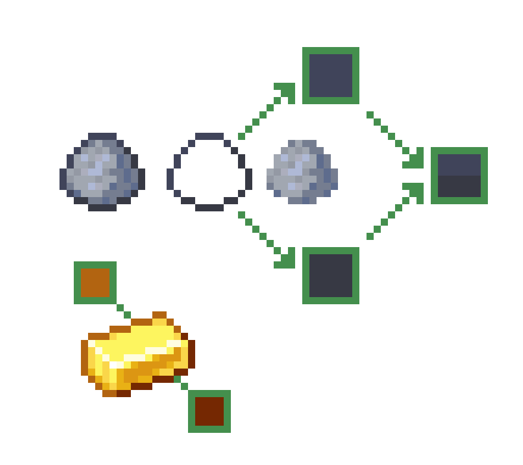
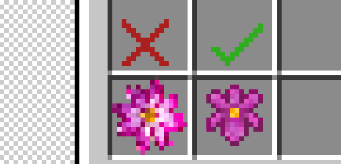
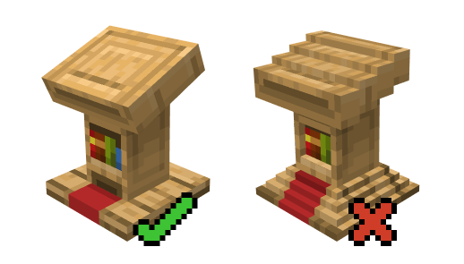
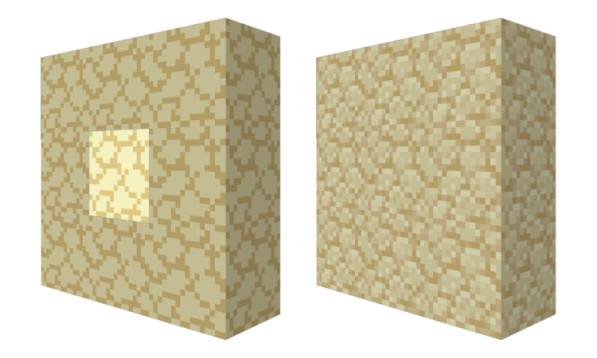
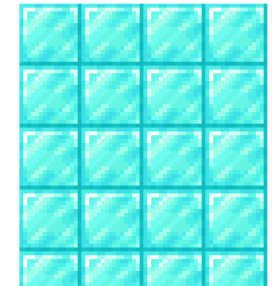

This guideline will more than likely grow a lot as we make more progress. After an internal overview and discussions, we have gathered quite a few things to help us give everyone a bit more of some art direction and guidelines to help us move art a bit forward.

# Guidelines
#### 16 x 16 pixel ratio for all the artwork
#### Stay within the realm of Minecraft style
#### Icons/sprites have a darkened border around them

We should try to always keep this style aspect because it's what makes items look like they are in a Minecraft style. The amount of how dark a border is can be subjective, but I would refrain from using pure black.
Many may not realize but even the darker border follows shading/lighting where the bottom sides are often darker to give a shadow effect.

And it can be subtle or even a bit more contrasting.
A Minecraft item slot in almost all GUI containers like the inventory are all 16x16

As much as humanly possible we should strive to always keep a 1px space between items and the border of the 16x16 box

Sometimes this is not always possible, but we should try to keep it this way as much as we possibly can. Here is an example of how it sometimes does not:

It's okay if small parts sometimes touch the edges, just try to refrain from having things touch edges as much as possible.
(This only applies to items that will be in inventory - this does not apply to icons like abilities)
#### Icons should be fairly simplified, but this does not mean that they should be flat or boring
This means that you should really try to simplify your drawing/idea as much as you can while still being able to convey what it is clearly to the audience.
If you make very over-complicated icons, the details can get lost or blend together when small - making it hard or impossible for viewers to understand what the item is.

# 3D Objects, Workbenches, Etc.
#### Keep 3D builds as simple as possible and let the texture do most of the heavy lifting
#### Do not use too many shapes/voxels for "details" when those details could be achieved with the texture

#### 3D and block textures should also follow the 16x16 pixel ratio rule
#### Most small objects like teeth and other details are usually flat and not full small voxels

#### Always make sure that the tiling of a block makes sense and doesn't create weird shapes or has a disconnected tiling effect
You typically want to be creating seamless tiles in most cases
Of course there are exceptions - and they are for a good reason.

Like with things such as a diamond, gold, iron blocks, and even blocks like the sealantern as well
